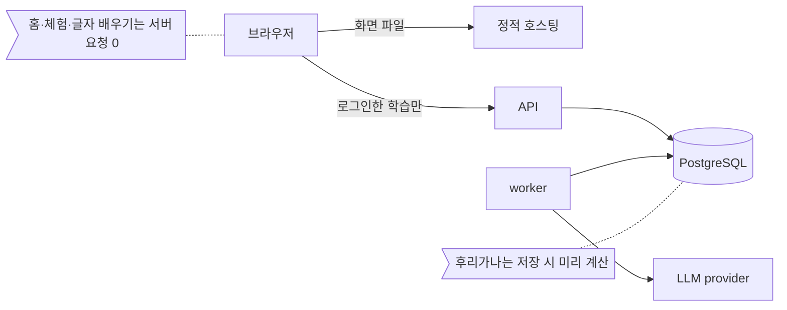

# Nihongo Context

일본어 표현을 실제 문장 속에서 익히는 개인용 학습 앱이에요.
목표는 JLPT가 아니에요.
일본어 YouTube와 일상 회화를 알아듣는 거예요.

## 바로 써보기

https://japanese.our-lab-never-sleeps.xyz

로그인 없이 써 볼 수 있어요.
첫 화면에서 두 가지 중 하나를 골라요.

-   **표현 학습 체험해 보기**: 모르는 표현을 눌러 뜻을 확인해요.
-   **글자부터 배우기**: 히라가나와 가타카나를 표와 퀴즈로 익혀요.

## 무엇을 할 수 있나

-   **선택 홈.** 처음 열면 체험과 글자 배우기 중에서 골라요.
-   **표현 학습 체험.** 고정된 일본어 문장 171개로 실제 학습 화면을 써 봐요.
    -   문장 속 표현을 누르면 설명이 올라와요.
    -   `문장 뜻 보기`를 누르면 번역이 펼쳐져요.
    -   표현마다 알고 있었는지 스스로 골라요. 고르지 않고 넘어가도 돼요.
    -   `몰랐음`이나 `애매함`을 고르면 그 표현이 나온 문장을 뒤에서 한 번 더 보여줘요.
    -   진도는 이 브라우저에만 저장돼요. 다시 열면 이어서 볼 수 있어요.
-   **히라가나·가타카나 배우기.** 청음부터 외래어까지 표와 단어 목록으로 볼 수 있어요.
    -   퀴즈는 두 가지예요.
    -   `보고 읽기`는 정답을 보고 맞았는지 직접 눌러요.
    -   `보고 고르기`는 로마자 네 개 중에서 골라요.
    -   틀린 문제는 라운드 끝에 한 번 더 나와요.
-   **후리가나.** 문장 속 한자 위에 읽기를 달아 줘요.
    -   기본은 꺼져 있어요. 상단바에서 켤 수 있어요.
-   **로그인 학습.** 운영자 개인이 쓰는 학습이에요.
    -   회원가입은 없어요.
    -   방문자는 체험과 글자 배우기를 쓰면 돼요.

## 어떻게 공부하게 되나

로그인한 학습은 이렇게 흘러가요.

1.  일본어 문장이 먼저 나와요. 번역은 숨겨져 있어요.
2.  모르는 표현을 눌러요.
3.  읽기와 뜻, 뉘앙스 설명을 봐요.
4.  필요하면 문장 번역을 펼쳐요.
5.  그 표현을 알고 있었는지 스스로 골라요. 고르지 않고 넘어가도 돼요.
6.  그 표현을 다시 만나요. 처음엔 처음 본 문장이나 비슷한 문장으로 만나요.
    익숙해지면 다른 문장 속에서 만나요.

언제 무엇을 다시 보여줄지는 앱의 학습 엔진이 정해요.
새 문장은 LLM이 미리 만들어 둬요.

체험은 같은 조작을 고정 문장으로만 해 보는 거예요.
문장 171개를 순서대로 봐요.
`몰랐음`이나 `애매함`을 고르면 그 표현이 나온 문장을 뒤에서 한 번 더 봐요.
새 문장을 만들지 않고, 서버에 학습 기록을 남기지도 않아요.

## 어떻게 돌아가나



-   화면은 정적 파일이에요. 홈과 체험, 글자 배우기는 이 파일만으로 돌아가요.
-   로그인한 학습만 API에 연결해요.
-   학습 기록은 PostgreSQL에 저장해요.
-   LLM은 worker만 불러요. API 요청 중에는 부르지 않아요.
-   후리가나는 문장을 저장할 때 미리 계산해요. 화면에서는 저장된 읽기를 보여주기만 해요.

## 기술 스택

-   **백엔드:** Python 3.12, FastAPI, SQLAlchemy, Alembic, PostgreSQL 16
-   **간격 반복:** FSRS
-   **프론트엔드:** TypeScript, Vite. UI 프레임워크는 쓰지 않아요.
-   **호스팅:** 화면은 Cloudflare 정적 호스팅, 서버는 Docker compose
-   **LLM:** LLM provider(현재 OpenAI). worker에서만 불러요.
-   **후리가나:** SudachiPy, SudachiDict-core (Apache-2.0). 사전 일부는 UniDic(BSD-3-Clause)에서 왔어요.

## 비용과 개인정보

-   방문자 화면은 정적 파일로만 돌아가요.
-   그래서 방문자가 써도 API나 LLM 비용이 들지 않아요.
-   LLM은 운영자가 학습할 때 worker가 불러요.
-   LLM 사용량에는 하루 한도가 있어요.
-   방문자의 후리가나 설정과 진도는 이 브라우저의 localStorage에만 저장돼요.
-   이 값은 서버로 보내지 않아요.
-   화면 파일은 일반 웹사이트처럼 정적 호스팅을 거쳐 받아요.

## 개발자용

### 로컬 실행

``` bash
cp .env.example .env     # 값을 채워요. .env는 Git에 넣지 않아요.
make install             # uv sync
make run                 # API 서버
make frontend-build      # frontend/ 에서 npm ci && npm run build
```

로컬 PostgreSQL은 `make db-up-local`을 써요(pgserver, [ADR-002](docs/decisions/ADR-002-local-dev-database.md)).
stdout에는 DSN만 나와요.

``` bash
export DATABASE_URL="$(make db-up-local)"
make db-reset ARGS=--yes   # DROP -> CREATE -> alembic upgrade head. APP_ENV=production이면 거부해요
make seed
```

-   `make db-up`(docker compose)은 로컬 개발용이 아니에요.
-   compose 파일이 운영 정책 파일 경로(`NC_CONFIG_PATH`)를 요구해요.
-   그래서 `.env.example`을 그대로 복사한 `.env`로는 실패해요.
-   API 문서(`/docs`, `/redoc`)와 OpenAPI 스키마는 `APP_ENV=development`일 때만 열려요. 기본값에서는 404예요.

### 테스트

``` bash
make install lint typecheck test   # ruff, mypy (strict), pytest
make frontend-test                 # frontend/ 에서 npm ci && npm test
make test-e2e                      # 실제 Chrome으로 도는 브라우저 E2E
make demo-fixture                  # seed/에서 체험 문장을 다시 만들어요
make demo-fixture ARGS=--check     # 커밋된 체험 문장과 같은지만 확인해요
```

-   `lint`, `typecheck`, `test`는 DB를 따로 준비하지 않아도 돌아요.
-   PostgreSQL이 필요한 테스트는 pgserver로 `data/pgtest/`에 테스트 전용 서버를 스스로 띄워요.
-   브라우저 E2E는 `make test`에 들어가지 않아요. `make test-e2e`로 따로 돌려요.

### 문서 지도

명세 버전은 v0.2예요.
지금 마일스톤은 MVP-02 Onboarding이에요.
MVP-02는 MVP-01 Core Learning 위에 더하는 차이(delta)예요.

-   [`spec/00~06`](spec/): 오래 유지할 제품·학습·기술 원칙
-   [`spec/mvp-01-core/`](spec/mvp-01-core/): 현재 구현 범위. MVP-02 규칙도 제자리에서 반영했어요
-   [`spec/mvp-02-onboarding/`](spec/mvp-02-onboarding/): MVP-02 범위 delta, 테스트 계획, 합격 기준
-   [`spec/future/`](spec/future/): 지금 구현하지 않지만 보존할 장기 설계
-   [`spec/reference/ui/`](spec/reference/ui/): 시각·인터랙션 reference
-   [`spec/CHANGELOG.md`](spec/CHANGELOG.md): 명세 변경 기록
-   [`docs/decisions/`](docs/decisions/): 되돌리기 비싼 결정(ADR-001~022)
-   [`AGENTS.md`](AGENTS.md): 구현 에이전트 규칙
-   [`seed/README.md`](seed/README.md): starter seed 형식과 적재
-   [`infra/DEPLOY.md`](infra/DEPLOY.md): 운영 배포 문서
-   [`updates/`](updates/README.md): 변경 요청과 진행 상태. **명세가 아니에요.**
    `spec/`에 반영된 뒤에만 구현해요

### 우선순위

``` text
MVP 구현 source of truth:
    spec/mvp-01-core/* + spec/mvp-02-onboarding/* (delta)

Global 문서 (spec/00~06):
    제품/기술 제약을 주지만 MVP Scope를 넓히지 않아요.

Future (spec/future/*):
    구현 지시가 아니에요.
```

충돌하면 이 순서를 따라요.

1.  `spec/mvp-01-core/*` + `spec/mvp-02-onboarding/*`(delta)의 승인된 기능/상태 규칙
2.  Global principles (`spec/00~06`)
3.  UI reference (`spec/reference/ui/`)
4.  구현 편의

-   `updates/`의 요청서는 이 순서에 들어가지 않아요. 요청이지 명세가 아니에요.
-   Global/Future 문서에 숫자나 아이디어가 있다는 이유만으로 구현하지 않아요.
-   명세 충돌을 발견하면 임의로 기능을 더하지 않아요. 충돌을 기록하고 최소 변경으로 풀어요.
-   MVP는 버릴 prototype이 아니에요. 완성 제품의 작고 안정적인 첫 조각이에요.

### 운영 배포

운영 배포는 [`infra/DEPLOY.md`](infra/DEPLOY.md)를 따라요.

## 로드맵

요청 목록과 상태는 [`updates/ROADMAP.md`](updates/ROADMAP.md)에 있어요.
